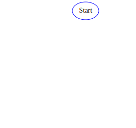
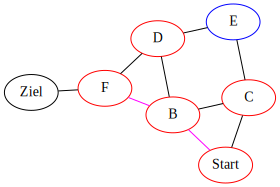

---
presentation:
  theme: serif.css
  width: 1920
  height: 1080
  transition: 'none'
  transitionSpeed: 'fast'
  backgroundTransition: 'none'
  overview: true
  progress: true
  slideNumber: true
---

<!-- slide -->

0. Startknoten *Start* auf Queue legen

Queue: in -> [  ] -> out

besucht: []

   

{width=864.0 height=756.0}
   

   

{width=864.0 height=756.0}
   

<!-- slide -->

0. Startknoten *Start* liegt auf Queue

Queue: in -> [ ->Start ] -> out

besucht: []

   

{width=864.0 height=756.0}
   

   

{width=864.0 height=756.0}
   

<!-- slide -->

1. Pfad *->Start* von Queue nehmen

Queue: in -> [  ] -> out

besucht: []

   

{width=864.0 height=756.0}
   

   

{width=864.0 height=756.0}
   

<!-- slide -->

2. Pfad *->Start* endet nicht im Zielknoten, Knoten Start als besucht markieren

Queue: in -> [  ] -> out

besucht: [Start]

   

{width=864.0 height=756.0}
   

   

{width=864.0 height=756.0}
   

<!-- slide -->

3. Pfade mit den neuen unbesuchten Kindknoten auf Queue legen.

Queue: in -> [ ->Start->C, ->Start->B ] -> out

besucht: [Start]

   

{width=864.0 height=756.0}
   

   

{width=864.0 height=756.0}
   

<!-- slide -->

1. Pfad *->Start->B* von Queue nehmen

Queue: in -> [ ->Start->C ] -> out

besucht: [Start]

   

{width=864.0 height=756.0}
   

   

{width=864.0 height=756.0}
   

<!-- slide -->

2. Pfad *->Start->B* endet nicht im Zielknoten, Knoten B als besucht markieren

Queue: in -> [ ->Start->C ] -> out

besucht: [B, Start]

   

{width=864.0 height=756.0}
   

   

{width=864.0 height=756.0}
   

<!-- slide -->

3. Pfade mit den neuen unbesuchten Kindknoten auf Queue legen.

Queue: in -> [ ->Start->B->F, ->Start->B->D, ->Start->B->C, ->Start->C ] -> out

besucht: [B, Start]

   

{width=864.0 height=756.0}
   

   

{width=864.0 height=756.0}
   

<!-- slide -->

1. Pfad *->Start->C* von Queue nehmen

Queue: in -> [ ->Start->B->F, ->Start->B->D, ->Start->B->C ] -> out

besucht: [B, Start]

   

{width=864.0 height=756.0}
   

   

{width=864.0 height=756.0}
   

<!-- slide -->

2. Pfad *->Start->C* endet nicht im Zielknoten, Knoten C als besucht markieren

Queue: in -> [ ->Start->B->F, ->Start->B->D, ->Start->B->C ] -> out

besucht: [B, C, Start]

   

{width=864.0 height=756.0}
   

   

{width=864.0 height=756.0}
   

<!-- slide -->

3. Pfade mit den neuen unbesuchten Kindknoten auf Queue legen.

Queue: in -> [ ->Start->C->E, ->Start->B->F, ->Start->B->D, ->Start->B->C ] -> out

besucht: [B, C, Start]

   

{width=864.0 height=756.0}
   

   

{width=864.0 height=756.0}
   

<!-- slide -->

1. Pfad *->Start->B->C* von Queue nehmen

Queue: in -> [ ->Start->C->E, ->Start->B->F, ->Start->B->D ] -> out

besucht: [B, C, Start]

   

{width=864.0 height=756.0}
   

   

{width=864.0 height=756.0}
   

<!-- slide -->

2. Knoten wurde schon besucht

Queue: in -> [ ->Start->C->E, ->Start->B->F, ->Start->B->D ] -> out

besucht: [B, C, Start]

   

{width=864.0 height=756.0}
   

   

{width=864.0 height=756.0}
   

<!-- slide -->

1. Pfad *->Start->B->D* von Queue nehmen

Queue: in -> [ ->Start->C->E, ->Start->B->F ] -> out

besucht: [B, C, Start]

   

{width=864.0 height=756.0}
   

   

{width=864.0 height=756.0}
   

<!-- slide -->

2. Pfad *->Start->B->D* endet nicht im Zielknoten, Knoten D als besucht markieren

Queue: in -> [ ->Start->C->E, ->Start->B->F ] -> out

besucht: [B, C, D, Start]

   

{width=864.0 height=756.0}
   

   

{width=864.0 height=756.0}
   

<!-- slide -->

3. Pfade mit den neuen unbesuchten Kindknoten auf Queue legen.

Queue: in -> [ ->Start->B->D->F, ->Start->B->D->E, ->Start->C->E, ->Start->B->F ] -> out

besucht: [B, C, D, Start]

   

{width=864.0 height=756.0}
   

   

{width=864.0 height=756.0}
   

<!-- slide -->

1. Pfad *->Start->B->F* von Queue nehmen

Queue: in -> [ ->Start->B->D->F, ->Start->B->D->E, ->Start->C->E ] -> out

besucht: [B, C, D, Start]

   

{width=864.0 height=756.0}
   

   

{width=864.0 height=756.0}
   

<!-- slide -->

2. Pfad *->Start->B->F* endet nicht im Zielknoten, Knoten F als besucht markieren

Queue: in -> [ ->Start->B->D->F, ->Start->B->D->E, ->Start->C->E ] -> out

besucht: [B, C, D, F, Start]

   

{width=864.0 height=756.0}
   

   

{width=864.0 height=756.0}
   

<!-- slide -->

3. Pfade mit den neuen unbesuchten Kindknoten auf Queue legen.

Queue: in -> [ ->Start->B->F->Ziel, ->Start->B->D->F, ->Start->B->D->E, ->Start->C->E ] -> out

besucht: [B, C, D, F, Start]

   

{width=864.0 height=756.0}
   

   

{width=864.0 height=756.0}
   

<!-- slide -->

1. Pfad *->Start->C->E* von Queue nehmen

Queue: in -> [ ->Start->B->F->Ziel, ->Start->B->D->F, ->Start->B->D->E ] -> out

besucht: [B, C, D, F, Start]

   

{width=864.0 height=756.0}
   

   

{width=864.0 height=756.0}
   

<!-- slide -->

2. Pfad *->Start->C->E* endet nicht im Zielknoten, Knoten E als besucht markieren

Queue: in -> [ ->Start->B->F->Ziel, ->Start->B->D->F, ->Start->B->D->E ] -> out

besucht: [B, C, D, E, F, Start]

   

{width=864.0 height=756.0}
   

   

{width=864.0 height=756.0}
   

<!-- slide -->

3. Pfade mit den neuen unbesuchten Kindknoten auf Queue legen.

Queue: in -> [ ->Start->B->F->Ziel, ->Start->B->D->F, ->Start->B->D->E ] -> out

besucht: [B, C, D, E, F, Start]

   

{width=864.0 height=756.0}
   

   

{width=864.0 height=756.0}
   

<!-- slide -->

1. Pfad *->Start->B->D->E* von Queue nehmen

Queue: in -> [ ->Start->B->F->Ziel, ->Start->B->D->F ] -> out

besucht: [B, C, D, E, F, Start]

   

{width=864.0 height=756.0}
   

   

{width=864.0 height=756.0}
   

<!-- slide -->

2. Knoten wurde schon besucht

Queue: in -> [ ->Start->B->F->Ziel, ->Start->B->D->F ] -> out

besucht: [B, C, D, E, F, Start]

   

{width=864.0 height=756.0}
   

   

{width=864.0 height=756.0}
   

<!-- slide -->

1. Pfad *->Start->B->D->F* von Queue nehmen

Queue: in -> [ ->Start->B->F->Ziel ] -> out

besucht: [B, C, D, E, F, Start]

   

{width=864.0 height=756.0}
   

   

{width=864.0 height=756.0}
   

<!-- slide -->

2. Knoten wurde schon besucht

Queue: in -> [ ->Start->B->F->Ziel ] -> out

besucht: [B, C, D, E, F, Start]

   

{width=864.0 height=756.0}
   

   

{width=864.0 height=756.0}
   

<!-- slide -->

1. Pfad *->Start->B->F->Ziel* von Queue nehmen. Ziel errreicht -> ENDE

Queue: in -> [  ] -> out

besucht: [B, C, D, E, F, Start]

   

{width=864.0 height=756.0}
   

   

{width=864.0 height=756.0}
   

