---
presentation:
  theme: serif.css
  width: 1920
  height: 1080
  transition: 'none'
  transitionSpeed: 'fast'
  backgroundTransition: 'none'
  overview: true
  progress: true
  slideNumber: true
---

<!-- slide -->

0. Startknoten *Start* auf Stack legen

Stack: in,out <-> [  ]

besucht: []

   

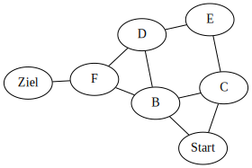{width=864.0 height=756.0}
   

   

{width=864.0 height=756.0}
   

<!-- slide -->

0. Startknoten *Start* liegt auf Stack

Stack: in,out <-> [ ->Start ]

besucht: []

   

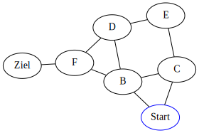{width=864.0 height=756.0}
   

   

{width=864.0 height=756.0}
   

<!-- slide -->

1. Pfad *->Start* von Stack nehmen

Stack: in,out <-> [  ]

besucht: []

   

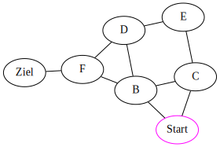{width=864.0 height=756.0}
   

   

{width=864.0 height=756.0}
   

<!-- slide -->

2. Pfad *->Start* endet nicht im Zielknoten, Knoten Start als besucht markieren

Stack: in,out <-> [  ]

besucht: [Start]

   

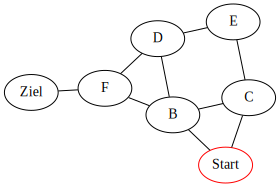{width=864.0 height=756.0}
   

   

{width=864.0 height=756.0}
   

<!-- slide -->

3. Pfade mit den neuen unbesuchten Kindknoten auf Stack legen.

Stack: in,out <-> [ ->Start->B, ->Start->C ]

besucht: [Start]

   

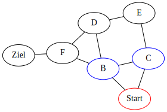{width=864.0 height=756.0}
   

   

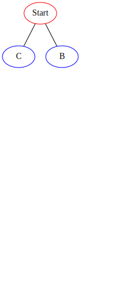{width=864.0 height=756.0}
   

<!-- slide -->

1. Pfad *->Start->B* von Stack nehmen

Stack: in,out <-> [ ->Start->C ]

besucht: [Start]

   

{width=864.0 height=756.0}
   

   

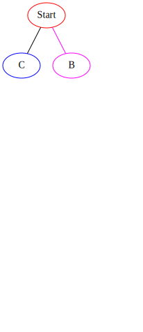{width=864.0 height=756.0}
   

<!-- slide -->

2. Pfad *->Start->B* endet nicht im Zielknoten, Knoten B als besucht markieren

Stack: in,out <-> [ ->Start->C ]

besucht: [B, Start]

   

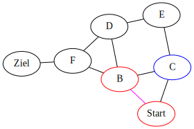{width=864.0 height=756.0}
   

   

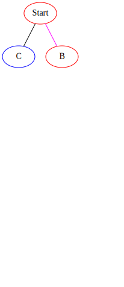{width=864.0 height=756.0}
   

<!-- slide -->

3. Pfade mit den neuen unbesuchten Kindknoten auf Stack legen.

Stack: in,out <-> [ ->Start->B->C, ->Start->B->D, ->Start->B->F, ->Start->C ]

besucht: [B, Start]

   

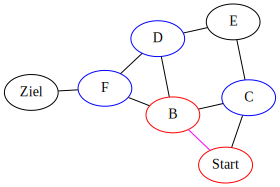{width=864.0 height=756.0}
   

   

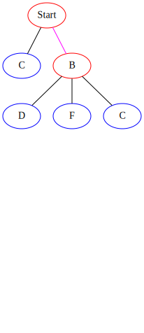{width=864.0 height=756.0}
   

<!-- slide -->

1. Pfad *->Start->B->C* von Stack nehmen

Stack: in,out <-> [ ->Start->B->D, ->Start->B->F, ->Start->C ]

besucht: [B, Start]

   

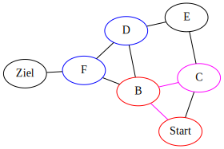{width=864.0 height=756.0}
   

   

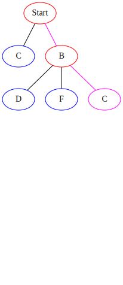{width=864.0 height=756.0}
   

<!-- slide -->

2. Pfad *->Start->B->C* endet nicht im Zielknoten, Knoten C als besucht markieren

Stack: in,out <-> [ ->Start->B->D, ->Start->B->F, ->Start->C ]

besucht: [B, C, Start]

   

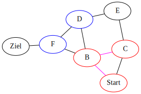{width=864.0 height=756.0}
   

   

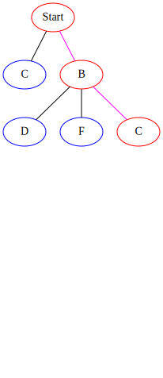{width=864.0 height=756.0}
   

<!-- slide -->

3. Pfade mit den neuen unbesuchten Kindknoten auf Stack legen.

Stack: in,out <-> [ ->Start->B->C->E, ->Start->B->D, ->Start->B->F, ->Start->C ]

besucht: [B, C, Start]

   

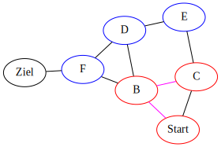{width=864.0 height=756.0}
   

   

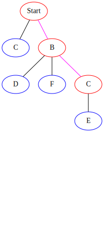{width=864.0 height=756.0}
   

<!-- slide -->

1. Pfad *->Start->B->C->E* von Stack nehmen

Stack: in,out <-> [ ->Start->B->D, ->Start->B->F, ->Start->C ]

besucht: [B, C, Start]

   

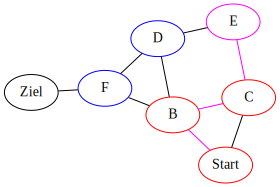{width=864.0 height=756.0}
   

   

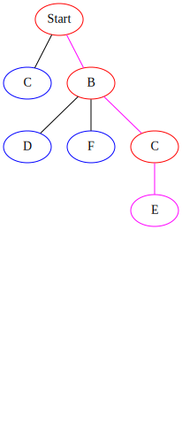{width=864.0 height=756.0}
   

<!-- slide -->

2. Pfad *->Start->B->C->E* endet nicht im Zielknoten, Knoten E als besucht markieren

Stack: in,out <-> [ ->Start->B->D, ->Start->B->F, ->Start->C ]

besucht: [B, C, E, Start]

   

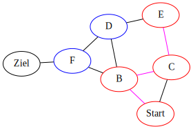{width=864.0 height=756.0}
   

   

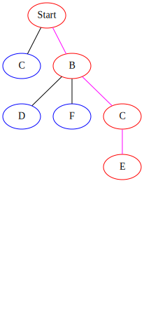{width=864.0 height=756.0}
   

<!-- slide -->

3. Pfade mit den neuen unbesuchten Kindknoten auf Stack legen.

Stack: in,out <-> [ ->Start->B->C->E->D, ->Start->B->D, ->Start->B->F, ->Start->C ]

besucht: [B, C, E, Start]

   

{width=864.0 height=756.0}
   

   

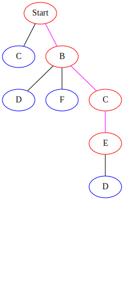{width=864.0 height=756.0}
   

<!-- slide -->

1. Pfad *->Start->B->C->E->D* von Stack nehmen

Stack: in,out <-> [ ->Start->B->D, ->Start->B->F, ->Start->C ]

besucht: [B, C, E, Start]

   

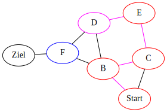{width=864.0 height=756.0}
   

   

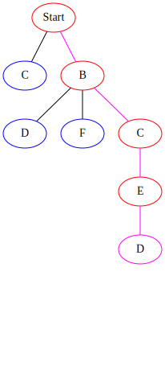{width=864.0 height=756.0}
   

<!-- slide -->

2. Pfad *->Start->B->C->E->D* endet nicht im Zielknoten, Knoten D als besucht markieren

Stack: in,out <-> [ ->Start->B->D, ->Start->B->F, ->Start->C ]

besucht: [B, C, D, E, Start]

   

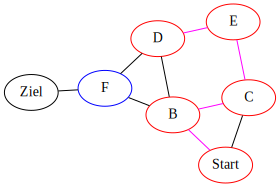{width=864.0 height=756.0}
   

   

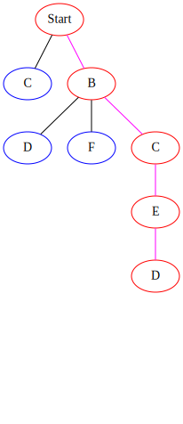{width=864.0 height=756.0}
   

<!-- slide -->

3. Pfade mit den neuen unbesuchten Kindknoten auf Stack legen.

Stack: in,out <-> [ ->Start->B->C->E->D->F, ->Start->B->D, ->Start->B->F, ->Start->C ]

besucht: [B, C, D, E, Start]

   

{width=864.0 height=756.0}
   

   

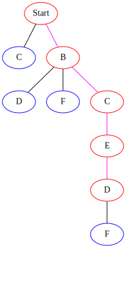{width=864.0 height=756.0}
   

<!-- slide -->

1. Pfad *->Start->B->C->E->D->F* von Stack nehmen

Stack: in,out <-> [ ->Start->B->D, ->Start->B->F, ->Start->C ]

besucht: [B, C, D, E, Start]

   

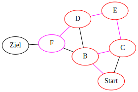{width=864.0 height=756.0}
   

   

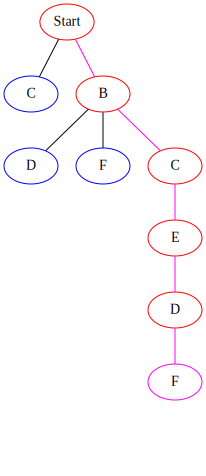{width=864.0 height=756.0}
   

<!-- slide -->

2. Pfad *->Start->B->C->E->D->F* endet nicht im Zielknoten, Knoten F als besucht markieren

Stack: in,out <-> [ ->Start->B->D, ->Start->B->F, ->Start->C ]

besucht: [B, C, D, E, F, Start]

   

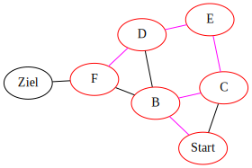{width=864.0 height=756.0}
   

   

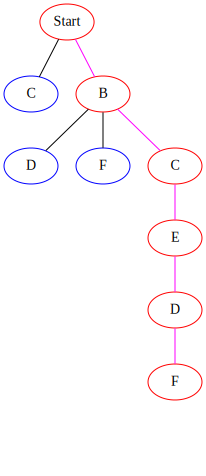{width=864.0 height=756.0}
   

<!-- slide -->

3. Pfade mit den neuen unbesuchten Kindknoten auf Stack legen.

Stack: in,out <-> [ ->Start->B->C->E->D->F->Ziel, ->Start->B->D, ->Start->B->F, ->Start->C ]

besucht: [B, C, D, E, F, Start]

   

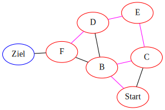{width=864.0 height=756.0}
   

   

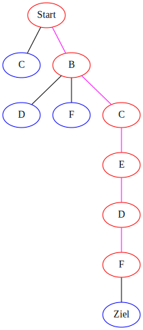{width=864.0 height=756.0}
   

<!-- slide -->

1. Pfad *->Start->B->C->E->D->F->Ziel* von Stack nehmen. Ziel errreicht -> ENDE

Stack: in,out <-> [ ->Start->B->D, ->Start->B->F, ->Start->C ]

besucht: [B, C, D, E, F, Start]

   

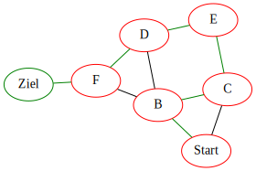{width=864.0 height=756.0}
   

   

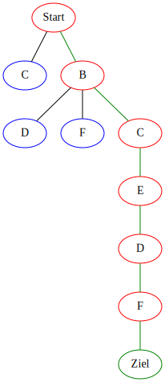{width=864.0 height=756.0}
   

