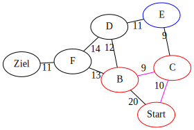

---
presentation:
  theme: serif.css
  width: 1920
  height: 1080
  transition: 'none'
  transitionSpeed: 'fast'
  backgroundTransition: 'none'
  overview: true
  progress: true
  slideNumber: true
---

<!-- slide -->

0. Startknoten *Start* auf Priority Queue legen

Priority Queue: in -> [  ] -> out

besucht: []

   

{width=864.0 height=756.0}
   

   

{width=864.0 height=756.0}
   

<!-- slide -->

0. Startknoten *Start* liegt auf Priority Queue

Priority Queue: in -> [ ->Start ] -> out

besucht: []

   

{width=864.0 height=756.0}
   

   

{width=864.0 height=756.0}
   

<!-- slide -->

1. Pfad *->Start* von Priority Queue nehmen

Priority Queue: in -> [  ] -> out

besucht: []

   

{width=864.0 height=756.0}
   

   

{width=864.0 height=756.0}
   

<!-- slide -->

2. Pfad *->Start* endet nicht im Zielknoten, Knoten Start als besucht markieren

Priority Queue: in -> [  ] -> out

besucht: [Start]

   

{width=864.0 height=756.0}
   

   

{width=864.0 height=756.0}
   

<!-- slide -->

3. Pfade mit den neuen unbesuchten Kindknoten auf Priority Queue legen.

Priority Queue: in -> [ ->Start->B (20), ->Start->C (10) ] -> out

besucht: [Start]

   

{width=864.0 height=756.0}
   

   

{width=864.0 height=756.0}
   

<!-- slide -->

1. Pfad *->Start->C (10)* von Priority Queue nehmen

Priority Queue: in -> [ ->Start->B (20) ] -> out

besucht: [Start]

   

{width=864.0 height=756.0}
   

   

{width=864.0 height=756.0}
   

<!-- slide -->

2. Pfad *->Start->C (10)* endet nicht im Zielknoten, Knoten C als besucht markieren

Priority Queue: in -> [ ->Start->B (20) ] -> out

besucht: [C, Start]

   

{width=864.0 height=756.0}
   

   

{width=864.0 height=756.0}
   

<!-- slide -->

3. Pfade mit den neuen unbesuchten Kindknoten auf Priority Queue legen.

Priority Queue: in -> [ ->Start->C->E (19), ->Start->B (20), ->Start->C->B (19) ] -> out

besucht: [C, Start]

   

{width=864.0 height=756.0}
   

   

{width=864.0 height=756.0}
   

<!-- slide -->

1. Pfad *->Start->C->B (19)* von Priority Queue nehmen

Priority Queue: in -> [ ->Start->B (20), ->Start->C->E (19) ] -> out

besucht: [C, Start]

   

{width=864.0 height=756.0}
   

   

{width=864.0 height=756.0}
   

<!-- slide -->

2. Pfad *->Start->C->B (19)* endet nicht im Zielknoten, Knoten B als besucht markieren

Priority Queue: in -> [ ->Start->B (20), ->Start->C->E (19) ] -> out

besucht: [B, C, Start]

   

{width=864.0 height=756.0}
   

   

{width=864.0 height=756.0}
   

<!-- slide -->

3. Pfade mit den neuen unbesuchten Kindknoten auf Priority Queue legen.

Priority Queue: in -> [ ->Start->C->B->F (32), ->Start->C->B->D (31), ->Start->B (20), ->Start->C->E (19) ] -> out

besucht: [B, C, Start]

   

{width=864.0 height=756.0}
   

   

{width=864.0 height=756.0}
   

<!-- slide -->

1. Pfad *->Start->C->E (19)* von Priority Queue nehmen

Priority Queue: in -> [ ->Start->C->B->D (31), ->Start->C->B->F (32), ->Start->B (20) ] -> out

besucht: [B, C, Start]

   

{width=864.0 height=756.0}
   

   

{width=864.0 height=756.0}
   

<!-- slide -->

2. Pfad *->Start->C->E (19)* endet nicht im Zielknoten, Knoten E als besucht markieren

Priority Queue: in -> [ ->Start->C->B->D (31), ->Start->C->B->F (32), ->Start->B (20) ] -> out

besucht: [B, C, E, Start]

   

{width=864.0 height=756.0}
   

   

{width=864.0 height=756.0}
   

<!-- slide -->

3. Pfade mit den neuen unbesuchten Kindknoten auf Priority Queue legen.

Priority Queue: in -> [ ->Start->C->B->F (32), ->Start->C->B->D (31), ->Start->C->E->D (30), ->Start->B (20) ] -> out

besucht: [B, C, E, Start]

   

{width=864.0 height=756.0}
   

   

{width=864.0 height=756.0}
   

<!-- slide -->

1. Pfad *->Start->B (20)* von Priority Queue nehmen

Priority Queue: in -> [ ->Start->C->B->D (31), ->Start->C->B->F (32), ->Start->C->E->D (30) ] -> out

besucht: [B, C, E, Start]

   

{width=864.0 height=756.0}
   

   

{width=864.0 height=756.0}
   

<!-- slide -->

2. Knoten wurde schon besucht

Priority Queue: in -> [ ->Start->C->B->D (31), ->Start->C->B->F (32), ->Start->C->E->D (30) ] -> out

besucht: [B, C, E, Start]

   

{width=864.0 height=756.0}
   

   

{width=864.0 height=756.0}
   

<!-- slide -->

1. Pfad *->Start->C->E->D (30)* von Priority Queue nehmen

Priority Queue: in -> [ ->Start->C->B->F (32), ->Start->C->B->D (31) ] -> out

besucht: [B, C, E, Start]

   

{width=864.0 height=756.0}
   

   

{width=864.0 height=756.0}
   

<!-- slide -->

2. Pfad *->Start->C->E->D (30)* endet nicht im Zielknoten, Knoten D als besucht markieren

Priority Queue: in -> [ ->Start->C->B->F (32), ->Start->C->B->D (31) ] -> out

besucht: [B, C, D, E, Start]

   

{width=864.0 height=756.0}
   

   

{width=864.0 height=756.0}
   

<!-- slide -->

3. Pfade mit den neuen unbesuchten Kindknoten auf Priority Queue legen.

Priority Queue: in -> [ ->Start->C->E->D->F (44), ->Start->C->B->F (32), ->Start->C->B->D (31) ] -> out

besucht: [B, C, D, E, Start]

   

{width=864.0 height=756.0}
   

   

{width=864.0 height=756.0}
   

<!-- slide -->

1. Pfad *->Start->C->B->D (31)* von Priority Queue nehmen

Priority Queue: in -> [ ->Start->C->E->D->F (44), ->Start->C->B->F (32) ] -> out

besucht: [B, C, D, E, Start]

   

{width=864.0 height=756.0}
   

   

{width=864.0 height=756.0}
   

<!-- slide -->

2. Knoten wurde schon besucht

Priority Queue: in -> [ ->Start->C->E->D->F (44), ->Start->C->B->F (32) ] -> out

besucht: [B, C, D, E, Start]

   

{width=864.0 height=756.0}
   

   

{width=864.0 height=756.0}
   

<!-- slide -->

1. Pfad *->Start->C->B->F (32)* von Priority Queue nehmen

Priority Queue: in -> [ ->Start->C->E->D->F (44) ] -> out

besucht: [B, C, D, E, Start]

   

{width=864.0 height=756.0}
   

   

{width=864.0 height=756.0}
   

<!-- slide -->

2. Pfad *->Start->C->B->F (32)* endet nicht im Zielknoten, Knoten F als besucht markieren

Priority Queue: in -> [ ->Start->C->E->D->F (44) ] -> out

besucht: [B, C, D, E, F, Start]

   

{width=864.0 height=756.0}
   

   

{width=864.0 height=756.0}
   

<!-- slide -->

3. Pfade mit den neuen unbesuchten Kindknoten auf Priority Queue legen.

Priority Queue: in -> [ ->Start->C->E->D->F (44), ->Start->C->B->F->Ziel (43) ] -> out

besucht: [B, C, D, E, F, Start]

   

{width=864.0 height=756.0}
   

   

{width=864.0 height=756.0}
   

<!-- slide -->

1. Pfad *->Start->C->B->F->Ziel (43)* von Priority Queue nehmen. Ziel errreicht -> ENDE

Priority Queue: in -> [ ->Start->C->E->D->F (44) ] -> out

besucht: [B, C, D, E, F, Start]

   

{width=864.0 height=756.0}
   

   

{width=864.0 height=756.0}
   

