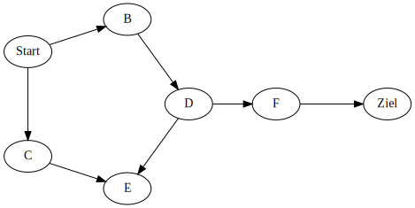

---
presentation:
  theme: serif.css
  width: 1920
  height: 1080
  transition: 'none'
  transitionSpeed: 'fast'
  backgroundTransition: 'none'
  overview: true
  progress: true
  slideNumber: true
---

<!-- slide -->

0. Startknoten *Start* auf Queue legen

Queue: in -> [  ] -> out

besucht: []

   

{width=864.0 height=756.0}
   

   

{width=864.0 height=756.0}
   

